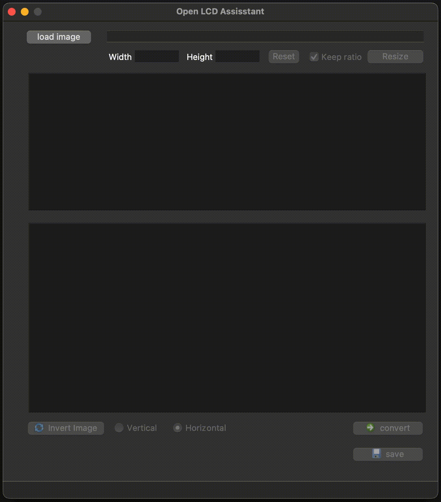
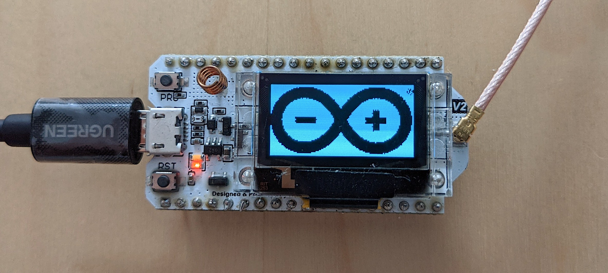
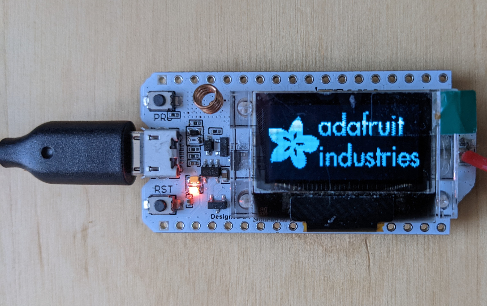

# Open LCD Assistant


## Contents
***
- [General Info](#general-info)
- [Usage](#usage)
- [Dependency](#dependency)
- [Test](#test)
- [Todo](#todo)
- [References](#references)


## General Info
***
I have been looking for a tool to convert bitmap images into byte arrays that can be used in monochrom OLED or LCD displays. The best known tool I found to perform this task is [LCD Assistant](http://en.radzio.dxp.pl/bitmap_converter/) but it works only on Windows. So I had to write something similar that can be used in MacOS, Linux or even Windows. You can gess whay I called it Open LCD Assistant :)


## Usage
***




## Dependency
***
To make the script work, you must install the following modules:

Pillow, for  image manipulation module:
```
pip install Pillow
```
PyQt5, a framework for gui development
```
pip install PyQt5
```
NumPy package for array computing
```
pip install numpy
```

Or, more simply by using the following command, all the dependencies will be installed automatically
```
pip install requirements.txt
```

## Test
***
The program has been tested in <strong><u> Horizontal mode and only </u></strong> with u8g2 library

- Software 
    * [Arduino IDE](https://www.arduino.cc/en/software)
    * [u8g2 Library](https://github.com/olikraus/u8g2/wiki)
- Hardware
    * [Heltec WiFi LoRa 32(V2)](https://heltec.org/project/wifi-lora-32/)

- Test code
    * Use the arduino code [arduino_ug82_code](./arduino_ug82_code/arduino_ug82_code.ino) example

- Test result

     
     


- Test Inversion of the Adafruit's Logo
     

## Todo
***
- ~~Add a Checkbox to give the user the possibility to invert the image colors~~
- Generate dmg and exe files 


## References
***
Some useful references used to write this program:

- [Displaying an image using PyQt5 in Python](https://www.codespeedy.com/displaying-an-image-using-pyqt5-in-python/)
- [xbm editor](https://xbm.jazzychad.net/)
- [image2cpp](http://javl.github.io/image2cpp/)
- [stackoverflow](https://stackoverflow.com/questions/41421033/python-invert-binary-image-invert-fails)