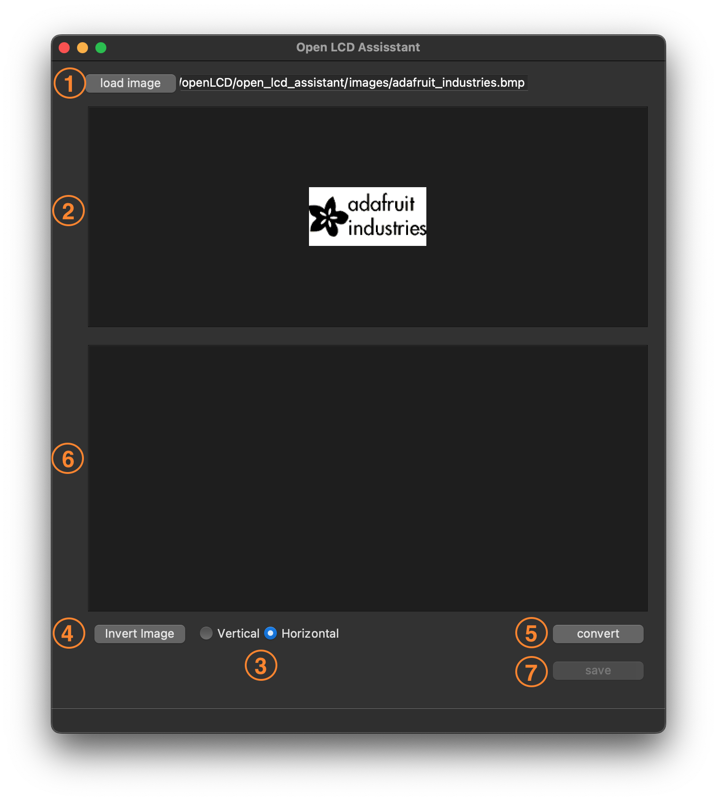

# Open LCD Assistant

## Contents

- [General Info](#general-info)
- [Usage](#usage)
- [Dependency](#dependency)
- [Todo](#todo)
- [References](#references)

## General Info
***
Write down general information about your project. It is a good idea to always put a project status in the readme file. This is where you can add it. 

## Usage

- `(1)` Load the BMP image
- `(2)` Preview of the loaded image
- `(3)` Choose the conversion method
- `(4)` Convert the image into bitmap array
- `(5)` The generated byte array (can be copied to your arduino code)
- `(6)` To save the byte array to .txt file

## Dependency

## Todo
- Add the possibility to invert the image

## References
Some helpful reference used to write this program:

- [Displaying an image using PyQt5 in Python](https://www.codespeedy.com/displaying-an-image-using-pyqt5-in-python/)
- [xbm editor](https://xbm.jazzychad.net/)
- [image2cpp](http://javl.github.io/image2cpp/)