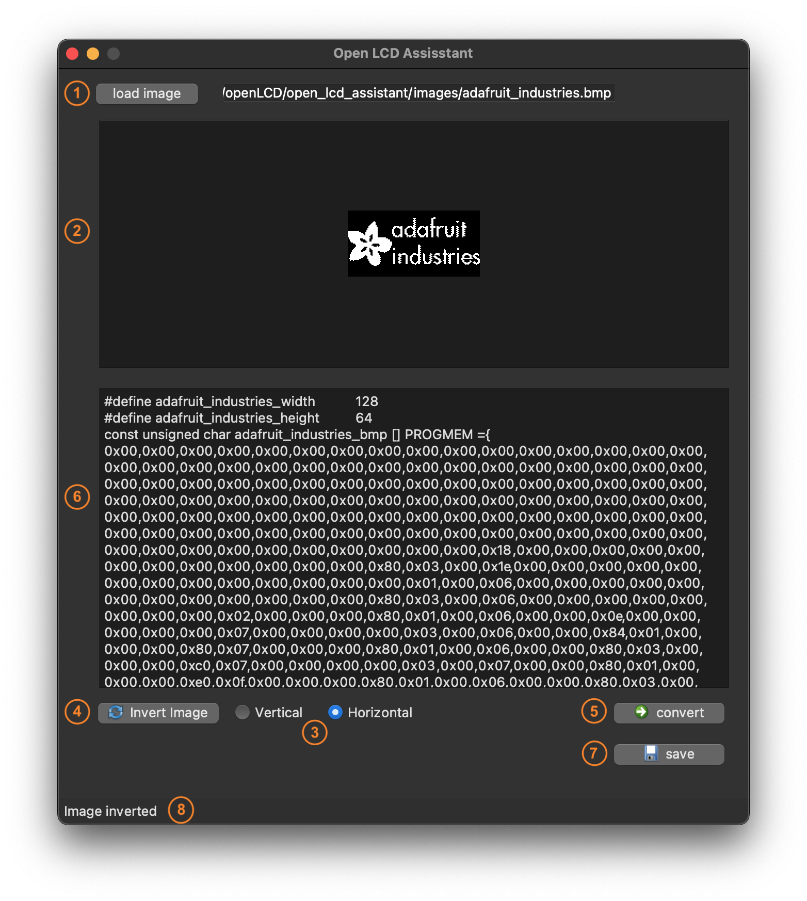

# Open LCD Assistant


## Contents
***
- [General Info](#general-info)
- [Usage](#usage)
- [Dependency](#dependency)
- [Todo](#todo)
- [References](#references)


## General Info
***
I have been looking for a tool to convert bitmap images into byte arrays that can be used in monochrom OLED or LCD displays. The best known tool I found to perform this task is [LCD Assistant](http://en.radzio.dxp.pl/bitmap_converter/) but it works only on Windows. So I had to write something similar that can be used in MacOS, Linux or even Windows. You can gess whay I called it Open LCD Assistant :)


## Usage
***

- `(1)` Load the BMP image
- `(2)` Preview of the loaded image
- `(3)` Choose the conversion method
- `(4)` Convert the image into bitmap array
- `(5)` The generated byte array (can be copied to your arduino code)
- `(6)` To save the byte array to .txt file




## Dependency
***
To make the script work, you must install the following modules:

Pillow, for  image manipulation module:
```
pip install Pillow
```
PyQt5, a framework for gui development
```
pip install PyQt5
```
NumPy package for array computing
```
pip install numpy
```


## Todo
***
- Add a Checkbox to give the user the possibility to invert the image colors


## References
***
Some useful references used to write this program:

- [Displaying an image using PyQt5 in Python](https://www.codespeedy.com/displaying-an-image-using-pyqt5-in-python/)
- [xbm editor](https://xbm.jazzychad.net/)
- [image2cpp](http://javl.github.io/image2cpp/)